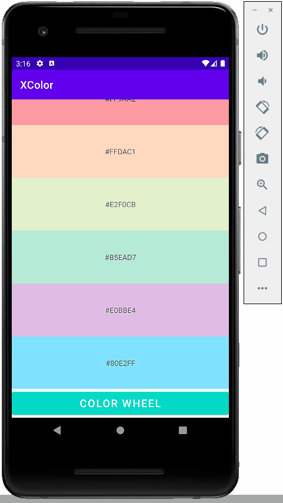

# Xcolor
Android software that spawns random colors or base on a certain color scheme. It also has a function that allow you to identitfy a color and its hex value.

# Demo

# How to setup, run and test
1. You will need android studio which you can download from here https://developer.android.com/studio.
2. Fork the project.
3. Clone or download the zip file.
5. Extract file and open it in android studio.
6. Before you can run and test the program you will need to install a virtual device
7. Go to tools then click on AVD manager
8. Then pick one of the pixel phone and hit R download then you should be good to run

# How to contribute
If you want to contribute to this project please select one of the issue from the issues tab and read README to know how set it up. Once you finish your assigned issue create a pull request and I will review code to merge it.

# Coding standard
 The project is mostly done in Kotlin, so you need to follow [Kotlin coding standard](https://developer.android.com/kotlin/style-guide)
